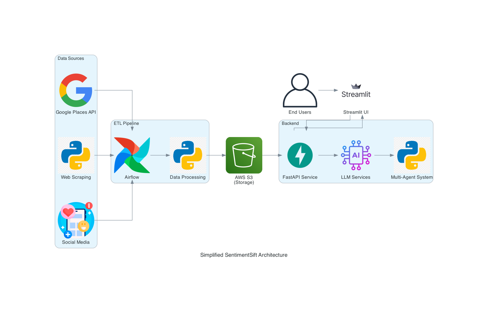

summary: Build SentimentSift to filter emotional bias from online reviews and provide objective insights.
id: sentimentsift-codelab
categories: AI, NLP, DataEngineering
tags: sentiment-analysis, airflow, streamlit, fastapi
authors: ko.yun@northeastern.edu

# SentimentSift: AI-Powered Review Analysis Platform

> **Codelab Proposal**  
> *Filtering Noise, Amplifying Truth.*

---

## Overview

**SentimentSift** is an AI-powered platform designed to filter emotional biases from online reviews and provide objective, fact-based insights for consumers and businesses. SentimentSift also providing a curated list of reliable food bloggers. For each trusted blogger, the platform displays a comprehensive list of all restaurants they've previously visited and reviewed, creating a reliable recommendation network that users can trust.

A restaurant owner saying that those who gave the restaurant one-star negative reviews were all saying it took too long to wait, not that the food was bad. So there is an API that can capture the reviews of this store, and then throw it into AI analysis, there should be different results.

---

## Introduction

### Background
Online reviews heavily influence consumer decisions but often contain emotional bias and manipulations. SentimentSift helps remove this noise.

### Objective
Develop a platform that filters emotional content from Google reviews and delivers clear, objective insights.

---

## Project Overview

### Scope
- **Data Sources:** Google Reviews API, web scraping
- **Technologies:** Airflow, FastAPI, Streamlit, LangGraph
- **Deliverables:** Review filtering web app with actionable insights

### Stakeholders
- Consumers
- Business owners
- Market researchers

### Architecture Diagram 

---

## Problem Statement

### Challenges
- Emotional bias in reviews
- Fake or manipulated reviews
- Inconsistent review quality
- Information overload for users
- Blogger Credibility

### Opportunities
- Enhance objectivity
- Save users' time
- Provide businesses with real insights
- Build trust in online reviews
- Reliable Food Blogger List

---

## Methodology

### Data Sources
- **Structured:** Google Places API, public datasets (CSV/JSON)
- **Unstructured:** Yelp, TripAdvisor, PDFs, social media

### Tools & Technologies
- **ETL:** Airflow, Python (BeautifulSoup, Scrapy)
- **Storage:** AWS S3, PostgreSQL
- **Backend:** FastAPI, Langraph, CrewAI, Docker
- **Frontend:** Streamlit, Plotly

---

## Project Plan & Timeline

### Milestones
1. **Apr 5-7:** Project setup, API integration
2. **Apr 8-10:** Data collection & sentiment analysis
3. **Apr 11-13:** Backend & agent implementation
4. **Apr 14-16:** Frontend development & integration
5. **Apr 17-18:** Testing, deployment, final presentation

---

## Team & Resources

### Roles
- **Data Engineering Lead:** ETL pipeline, API, database
- **AI/ML Specialist:** Model development, orchestration
- **Full-Stack Developer:** Frontend, backend, integration

---

## Risks and Mitigation

| Risk                     | Mitigation Strategy                             |
|--------------------------|-------------------------------------------------|
| API rate limiting         | Use rotating proxies & scheduled collection     |
| Model accuracy            | Ensemble models & validation techniques         |
| Scalability challenges    | Optimize storage and indexing                   |
| Legal & ethical concerns  | Ensure compliance with data regulations         |

---

## Expected Outcomes

### Goals
- >85% sentiment classification accuracy
- Process >10,000 reviews/hour
- >80% user satisfaction in testing

### Benefits
- Faster, objective decision-making
- Time savings (~50% reduction)
- Actionable feedback for businesses
- Improved market understanding

---

## Conclusion

SentimentSift bridges the gap between emotionally charged reviews and objective insights. By leveraging AI, natural language processing, and data pipelines, you'll build a tool that empowers consumers and businesses alike.

---

## Information
- Team: Anuj Rajendraprasad Nene, Sicheng Bao, Yung-Rou Ko
- Course: 7245 Big-Data Final Project

